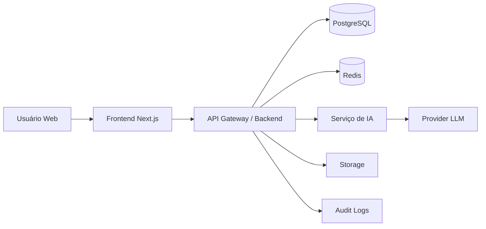

# GOSF — Blueprint de Implementação com IA
## Plataforma moderna, segura e orientada à LGPD para personalização educacional

> Documento de implementação para uso com IA, equipes de produto, design, frontend, backend e dados.
> 
> Objetivo: transformar o conceito inicial do projeto GOSF em um plano executável, moderno, escalável e seguro.

---

## 1. Resumo executivo

O projeto GOSF parte de uma ideia forte: usar avaliações cruzadas entre alunos e professores para gerar planos personalizados, feedback contínuo e dashboards claros.

A versão proposta neste documento evolui esse conceito para uma **plataforma SaaS educacional B2B2C**, com foco em:

- **escolas, cursos, faculdades e redes educacionais**;
- **experiência moderna e amigável**;
- **arquitetura segura e escalável**;
- **IA assistiva e auditável**;
- **conformidade com LGPD desde a origem (privacy by design)**;
- **capacidade de monetização e expansão de mercado**.

A recomendação estratégica é posicionar o GOSF não apenas como “sistema de avaliação”, mas como uma plataforma de:

**inteligência relacional educacional + personalização de aprendizagem + melhoria contínua docente**.

---

## 2. Leitura estratégica do material original

O arquivo base define corretamente quatro pilares:

1. planos de estudo personalizados para alunos;
2. planos de desenvolvimento para professores;
3. feedback estruturado e contínuo;
4. dashboards de desempenho.

Também define duas entradas centrais:

- aluno avalia professor;
- professor avalia aluno.

E propõe um motor de análise que transforma essas entradas em saídas úteis.

Esse núcleo deve ser mantido. O que precisa ser ampliado para implementação real é:

- modelo de negócio;
- definição de usuários e permissões;
- arquitetura técnica;
- segurança e LGPD;
- governança de IA;
- métricas de sucesso;
- roadmap incremental;
- design system e padrão UX;
- critérios de escalabilidade;
- estrutura de prompts e contratos de dados para IA.

---

## 3. Oportunidade de mercado

## 3.1 Problema real

Instituições educacionais normalmente possuem dados fragmentados em planilhas, formulários, LMSs e percepções subjetivas. O resultado costuma ser:

- baixa visibilidade sobre evolução do aluno;
- feedback tardio e pouco acionável;
- dificuldade de apoiar o desenvolvimento docente de forma objetiva;
- pouca padronização na leitura de desempenho;
- dificuldade em criar personalização sem elevar muito o custo operacional.

## 3.2 Oportunidade

O GOSF pode ocupar um espaço entre:

- plataformas de gestão educacional tradicionais;
- ferramentas de survey/feedback;
- LMSs sem inteligência aplicada;
- sistemas de people analytics adaptados para educação.

O diferencial não deve ser apenas “coletar avaliações”, mas **traduzir dados em ação personalizada**, com linguagem clara e recomendação prática.

## 3.3 Segmentos prioritários

### Fase 1 — melhor entrada no mercado

- escolas particulares de pequeno e médio porte;
- cursos livres e profissionalizantes;
- edtechs com trilhas próprias;
- faculdades com operação mais ágil.

### Fase 2

- redes educacionais;
- franquias de ensino;
- instituições de ensino superior com múltiplos campi.

### Fase 3

- expansão internacional;
- white-label para grupos educacionais;
- marketplace de intervenções pedagógicas e trilhas complementares.

---

## 4. Proposta de valor refinada

## 4.1 Para a instituição

- visão clara da qualidade pedagógica;
- redução de evasão por detecção precoce de risco;
- melhoria contínua baseada em evidência;
- padronização de feedback;
- indicadores consolidados para coordenação e direção.

## 4.2 Para o professor

- feedback estruturado e menos subjetivo;
- plano de desenvolvimento claro;
- sugestões práticas de melhoria de aula;
- acompanhamento de evolução no tempo;
- redução de ruído em avaliações isoladas.

## 4.3 Para o aluno

- plano de estudo personalizado;
- recomendações objetivas e amigáveis;
- sensação de acompanhamento real;
- histórico visual de progresso;
- maior engajamento por gamificação leve.

---

## 5. Posicionamento do produto

### Frase curta

**GOSF é uma plataforma de inteligência educacional que transforma avaliações em planos personalizados para alunos e professores.**

### Posicionamento moderno

**Uma plataforma orientada por dados e IA para fortalecer a relação professor–aluno, elevar desempenho e tornar feedback realmente acionável.**

---

## 6. Princípios de produto

1. **Clareza acima de complexidade**.
2. **IA como copiloto, não como caixa-preta soberana**.
3. **Dados mínimos necessários**.
4. **Feedback útil em linguagem humana**.
5. **Segurança e LGPD por padrão**.
6. **Design amigável, leve e responsivo**.
7. **Decisões explicáveis e auditáveis**.
8. **Métricas orientadas a impacto pedagógico**.

---

## 7. Perfis de usuário

## 7.1 Aluno

Acessa:
- auto percepção de progresso;
- plano de estudo;
- histórico de feedback;
- metas e recomendações;
- gamificação leve.

## 7.2 Professor

Acessa:
- avaliações recebidas;
- perfil de turma;
- evolução de indicadores;
- plano de desenvolvimento docente;
- sugestões pedagógicas geradas por IA.

## 7.3 Coordenador pedagógico

Acessa:
- visão agregada por turma, disciplina e período;
- indicadores de risco;
- distribuição de qualidade docente;
- auditoria de feedback e aderência.

## 7.4 Gestor institucional / administrador

Acessa:
- configuração da instituição;
- permissões;
- políticas de retenção;
- integrações;
- billing;
- governança e relatórios executivos.

---

## 8. Escopo funcional recomendado

## 8.1 MVP realista

### Módulo 1 — autenticação e tenancy
- login seguro;
- recuperação de senha;
- RBAC por perfil;
- isolamento por instituição.

### Módulo 2 — cadastro estrutural
- instituição;
- turmas;
- disciplinas;
- alunos;
- professores;
- vínculos professor–turma–disciplina.

### Módulo 3 — avaliações
- aluno avalia professor;
- professor avalia aluno;
- formulários configuráveis por instituição;
- escala de notas + comentários opcionais;
- janelas de avaliação por período.

### Módulo 4 — motor analítico inicial
- consolidação de scores;
- tendências;
- comparativos temporais;
- identificação de pontos fortes e fracos.

### Módulo 5 — IA assistiva
- geração de plano de estudo do aluno;
- geração de plano de desenvolvimento do professor;
- resumo explicável dos resultados;
- recomendações com base em templates e regras + LLM.

### Módulo 6 — dashboards
- dashboard do aluno;
- dashboard do professor;
- dashboard do coordenador.

### Módulo 7 — feedback contínuo
- notificações in-app;
- histórico de ciclos;
- tarefas/recomendações acompanháveis.

## 8.2 Fase pós-MVP

- benchmarking entre turmas;
- risco de evasão;
- integração com LMS;
- integração com calendário acadêmico;
- recomendação de conteúdo externo;
- relatórios executivos em PDF;
- trilhas automáticas por perfil;
- aplicativo mobile complementar.

---

## 9. Funcionalidades de IA recomendadas

## 9.1 O que a IA deve fazer

- resumir resultados educacionais em linguagem simples;
- gerar recomendações personalizadas;
- detectar padrões de risco e oportunidade;
- sugerir microações pedagógicas;
- adaptar tom e complexidade conforme perfil;
- gerar versões explicáveis e auditáveis do feedback.

## 9.2 O que a IA não deve fazer

- tomar decisão disciplinar automática;
- classificar aluno de forma irreversível;
- emitir diagnósticos psicológicos ou médicos;
- operar sem supervisão humana em temas sensíveis;
- ocultar a base de raciocínio usada no feedback.

## 9.3 Abordagem ideal

A melhor arquitetura de IA para o GOSF não é “LLM puro”.

A recomendação é usar uma camada híbrida:

1. **regras e scoring estruturado** para confiabilidade;
2. **camada de interpretação** para gerar explicações;
3. **LLM** para transformar dados estruturados em linguagem útil;
4. **guardrails** para evitar extrapolações indevidas.

### Fórmula ideal

**Dados estruturados + regras pedagógicas + prompts controlados + revisão humana opcional**.

---

## 10. Requisitos LGPD e privacidade

> Observação importante: a implementação final deve ser validada por assessoria jurídica especializada. Este documento oferece direcionamento técnico e de produto, não parecer jurídico.

## 10.1 Princípios obrigatórios

- finalidade definida;
- adequação;
- necessidade;
- livre acesso;
- qualidade dos dados;
- transparência;
- segurança;
- prevenção;
- não discriminação;
- responsabilização e prestação de contas.

## 10.2 Dados sensíveis e cuidado reforçado

Dados educacionais podem se tornar altamente sensíveis dependendo do contexto. O sistema deve evitar:

- inferências desnecessárias sobre saúde mental;
- uso de linguagem discriminatória;
- decisões automatizadas opacas;
- retenção excessiva de comentários livres;
- cruzamentos indevidos de dados pessoais.

## 10.3 Diretrizes práticas de privacidade

- consentimento quando aplicável e base legal bem definida;
- política de privacidade clara e granular;
- registro de finalidade por módulo;
- minimização de dados no onboarding;
- pseudonimização para analytics e treinamento interno;
- anonimização quando possível para análises agregadas;
- retenção configurável por instituição;
- exclusão lógica e trilha de exclusão;
- portal de solicitações do titular;
- trilha de auditoria para acesso a dados.

## 10.4 Privacy by design

Toda funcionalidade nova deve passar por checklist:

- qual dado coleta;
- por que coleta;
- quem acessa;
- por quanto tempo guarda;
- qual risco oferece;
- como excluir;
- como explicar ao usuário;
- se existe alternativa com menos dado pessoal.

---

## 11. Segurança recomendada

## 11.1 Controles essenciais

- autenticação segura com MFA opcional para admins;
- senhas com hash robusto (Argon2id ou bcrypt forte);
- JWT com rotação e expiração curta;
- refresh tokens com revogação;
- RBAC por tenant;
- rate limiting;
- proteção CSRF quando aplicável;
- proteção XSS e CSP forte;
- validação estrita de input;
- criptografia em trânsito com TLS 1.2+;
- criptografia em repouso para campos sensíveis;
- logs de auditoria imutáveis;
- segregação de ambientes;
- backup com política clara de retenção;
- monitoramento de incidentes.

## 11.2 Segurança de IA

- não enviar dados desnecessários ao provedor de IA;
- mascarar identificadores pessoais quando possível;
- manter catálogo dos prompts em versão controlada;
- registrar entradas e saídas com redaction;
- aplicar filtros contra prompt injection em campos livres;
- bloquear geração de conteúdo ofensivo ou discriminatório;
- versionar modelos e prompts por release.

---

## 12. Arquitetura recomendada

## 12.1 Stack sugerida

### Frontend web
- **Next.js 15+**
- **React 19+**
- **TypeScript**
- **Tailwind CSS**
- **shadcn/ui**
- **React Query / TanStack Query**
- **Zod**
- **React Hook Form**
- **Framer Motion**

### Backend
- **NestJS** ou **Fastify com TypeScript**
- **Prisma ORM**
- **PostgreSQL**
- **Redis** para cache, filas e rate limiting
- **BullMQ** para jobs assíncronos

### IA e processamento
- serviço separado para análise e geração;
- fila assíncrona para geração de relatórios e planos;
- provider abstraction para trocar modelos de IA sem reescrever produto.

### Infraestrutura
- **Docker**
- **CI/CD com GitHub Actions**
- **Vercel** no frontend ou infraestrutura equivalente
- **Render / Railway / Fly.io / AWS / GCP / Azure** no backend
- **S3 compatível** para storage de arquivos
- **Cloudflare** para WAF, CDN e proteção adicional

## 12.2 Arquitetura lógica



## 12.3 Multi-tenant

Modelo recomendado:

- tenancy lógica por `institution_id`;
- RBAC por escopo;
- filtros obrigatórios em todas as queries;
- eventuais clientes enterprise podem migrar para tenancy isolada no futuro.

---

## 13. Modelagem de domínio

## 13.1 Entidades principais

- Institution
- User
- Role
- StudentProfile
- TeacherProfile
- ClassGroup
- Subject
- Enrollment
- EvaluationCycle
- EvaluationForm
- EvaluationQuestion
- TeacherEvaluation
- StudentEvaluation
- ScoreAggregate
- StudentPlan
- TeacherDevelopmentPlan
- Notification
- AuditLog
- ConsentRecord
- DataRequest

## 13.2 Relacionamentos essenciais

- uma instituição possui usuários, turmas e formulários;
- um usuário pode ter perfil de aluno, professor ou admin;
- uma turma possui muitos alunos e professores vinculados por disciplina;
- avaliações pertencem a um ciclo;
- agregados são calculados por período, entidade e dimensão;
- planos gerados são versionados;
- cada ação relevante gera auditoria.

---

## 14. Estrutura de banco de dados inicial

```sql
institutions
- id
- name
- slug
- status
- created_at

users
- id
- institution_id
- email
- password_hash
- full_name
- role
- status
- last_login_at
- created_at

students
- id
- user_id
- registration_code
- grade_level

teachers
- id
- user_id
- department
- specialty

class_groups
- id
- institution_id
- name
- academic_period

subjects
- id
- institution_id
- name

enrollments
- id
- class_group_id
- student_id
- status

evaluation_cycles
- id
- institution_id
- title
- starts_at
- ends_at
- status

evaluation_forms
- id
- institution_id
- target_type
- title
- version

evaluation_questions
- id
- form_id
- dimension
- question_text
- response_type
- weight

teacher_evaluations
- id
- cycle_id
- form_id
- student_id
- teacher_id
- answers_json
- comment
- submitted_at

student_evaluations
- id
- cycle_id
- form_id
- teacher_id
- student_id
- answers_json
- comment
- submitted_at

score_aggregates
- id
- institution_id
- target_type
- target_id
- cycle_id
- dimension
- score
- trend
- computed_at

student_plans
- id
- student_id
- cycle_id
- version
- input_snapshot_json
- ai_output_json
- status
- generated_at

teacher_development_plans
- id
- teacher_id
- cycle_id
- version
- input_snapshot_json
- ai_output_json
- status
- generated_at

audit_logs
- id
- institution_id
- actor_user_id
- action
- resource_type
- resource_id
- metadata_json
- created_at
```

---

## 15. Design do produto e UX

## 15.1 Direção visual

A inspiração em produtos amigáveis como Duolingo é válida no tom, mas o GOSF precisa parecer mais institucional e confiável.

Recomendação visual:

- visual limpo;
- cores suaves com bom contraste;
- linguagem acolhedora, não infantil;
- cards claros;
- gráficos simples e legíveis;
- microinterações discretas;
- design responsivo mobile-first.

## 15.2 UX principles

- dashboards com leitura em menos de 10 segundos;
- feedback resumido primeiro, detalhamento depois;
- evitar telas sobrecarregadas;
- sempre mostrar “o que fazer agora”; 
- acessibilidade WCAG 2.2 AA como meta.

## 15.3 Estrutura de navegação sugerida

### Aluno
- Início
- Meu progresso
- Plano de estudo
- Feedbacks
- Metas
- Perfil e privacidade

### Professor
- Início
- Minhas turmas
- Avaliações
- Meu desenvolvimento
- Insights
- Perfil e privacidade

### Coordenador/Admin
- Visão geral
- Turmas
- Professores
- Alunos
- Ciclos de avaliação
- Relatórios
- Configurações
- Segurança e LGPD

---

## 16. Dashboards recomendados

## 16.1 Dashboard do aluno

Mostrar:
- nota global de evolução;
- principais forças;
- principais pontos de atenção;
- plano de estudo desta semana;
- histórico de tendência;
- checklist de ações.

## 16.2 Dashboard do professor

Mostrar:
- média por dimensão;
- comparação temporal;
- feedback resumido por IA;
- alertas de atenção;
- plano de desenvolvimento com microações.

## 16.3 Dashboard do coordenador

Mostrar:
- heatmap por turma/disciplina;
- variação por ciclo;
- docentes em destaque positivo;
- áreas que precisam intervenção;
- indicadores de risco institucional.

---

## 17. Motor analítico

## 17.1 Pipeline recomendado

1. ingestão das respostas;
2. validação e normalização;
3. cálculo de score por dimensão;
4. cálculo de tendência;
5. geração de sinais de risco/oportunidade;
6. montagem de snapshot estruturado;
7. envio controlado para IA;
8. geração de plano;
9. revisão opcional;
10. publicação em dashboard.

## 17.2 Dimensões exemplo

### Professor
- didática
- clareza
- organização
- engajamento
- justiça avaliativa

### Aluno
- participação
- consistência
- desempenho
- evolução
- entrega

## 17.3 Regras iniciais simples

Exemplo:
- score < 50: alerta alto;
- score entre 50 e 70: atenção moderada;
- score > 70: evolução positiva;
- tendência negativa por 2 ciclos: sinal de intervenção;
- comentário crítico + score baixo: revisão humana prioritária.

---

## 18. Estratégia de IA por camadas

## 18.1 Camada 1 — analítica determinística

Responsável por:
- calcular indicadores;
- detectar tendências;
- consolidar dados;
- fornecer explicabilidade base.

## 18.2 Camada 2 — geração assistida

Responsável por:
- resumir resultados;
- propor plano de ação;
- adaptar a linguagem;
- produzir conteúdo amigável.

## 18.3 Camada 3 — governança

Responsável por:
- validar saídas;
- bloquear exageros ou inferências sensíveis;
- registrar prompt, modelo e versão;
- permitir revisão humana.

---

## 19. Template de prompt para IA

## 19.1 Prompt base para plano do aluno

```txt
Você é um assistente pedagógico responsável por transformar dados educacionais em um plano de estudo claro, motivador, ético e objetivo.

Regras:
- Não invente dados.
- Não faça diagnóstico médico, psicológico ou social.
- Não use linguagem discriminatória.
- Baseie-se apenas nos indicadores e comentários fornecidos.
- Gere recomendações práticas para os próximos 7 e 30 dias.
- Use tom acolhedor, claro e profissional.
- Explique os pontos fortes e os pontos de atenção.
- Sempre inclua ações específicas, mensuráveis e possíveis.

Entrada estruturada:
{student_snapshot_json}

Saída esperada em JSON:
{
  "summary": "...",
  "strengths": ["..."],
  "attention_points": ["..."],
  "seven_day_plan": ["..."],
  "thirty_day_plan": ["..."],
  "motivation_message": "...",
  "confidence_notes": ["..."]
}
```

## 19.2 Prompt base para plano do professor

```txt
Você é um assistente de desenvolvimento docente.

Regras:
- Não invente fatos.
- Não use linguagem acusatória.
- Não tire conclusões fora dos dados.
- Transforme os indicadores em ações pedagógicas práticas.
- Priorize sugestões simples, aplicáveis e mensuráveis.
- Mantenha tom respeitoso e construtivo.

Entrada estruturada:
{teacher_snapshot_json}

Saída esperada em JSON:
{
  "summary": "...",
  "strengths": ["..."],
  "development_points": ["..."],
  "recommended_actions": ["..."],
  "classroom_experiments": ["..."],
  "next_cycle_focus": ["..."]
}
```

---

## 20. Contratos de API recomendados

## 20.1 Exemplos REST

### Auth
- `POST /api/v1/auth/login`
- `POST /api/v1/auth/refresh`
- `POST /api/v1/auth/logout`

### Instituição
- `GET /api/v1/institutions/me`
- `PATCH /api/v1/institutions/me`

### Usuários
- `GET /api/v1/users`
- `POST /api/v1/users`
- `PATCH /api/v1/users/:id`

### Avaliações
- `GET /api/v1/evaluation-cycles`
- `POST /api/v1/evaluation-cycles`
- `GET /api/v1/forms`
- `POST /api/v1/forms/:id/submit`

### Dashboards
- `GET /api/v1/dashboard/student/me`
- `GET /api/v1/dashboard/teacher/me`
- `GET /api/v1/dashboard/coordinator/overview`

### IA
- `POST /api/v1/ai/student-plan/:studentId/generate`
- `POST /api/v1/ai/teacher-plan/:teacherId/generate`
- `GET /api/v1/ai/jobs/:jobId`

### LGPD
- `GET /api/v1/privacy/consents`
- `POST /api/v1/privacy/data-request`
- `DELETE /api/v1/privacy/account`

---

## 21. Arquitetura frontend

## 21.1 Estrutura sugerida do projeto

```txt
src/
  app/
    (public)/
    (auth)/
    (student)/
    (teacher)/
    (admin)/
    api/
  components/
    ui/
    dashboard/
    forms/
    feedback/
  features/
    auth/
    evaluations/
    analytics/
    ai/
    privacy/
  lib/
    api/
    auth/
    schemas/
    utils/
    permissions/
  hooks/
  store/
  styles/
```

## 21.2 Padrões frontend

- server components onde fizer sentido;
- client components só quando necessário;
- schemas Zod em fronteira de entrada;
- estados assíncronos centralizados com TanStack Query;
- skeleton loading elegante;
- empty states bem escritos;
- tratamento completo de erro;
- telemetria de UX.

---

## 22. Arquitetura backend

## 22.1 Módulos sugeridos

- auth
- users
- institutions
- classes
- forms
- evaluations
- analytics
- ai
- notifications
- privacy
- audit
- billing

## 22.2 Padrões backend

- DTOs tipados;
- validação de payload;
- services desacoplados;
- repositórios claros;
- jobs assíncronos para análise pesada;
- idempotência em endpoints sensíveis;
- observabilidade com logs estruturados;
- testes unitários e de integração.

---

## 23. Observabilidade e operação

## 23.1 Métricas técnicas

- latência p95 de API;
- taxa de erro por endpoint;
- tempo de geração de plano por IA;
- filas pendentes;
- uso por tenant;
- incidentes de autorização;
- falhas de login.

## 23.2 Métricas de negócio

- taxa de adesão por ciclo;
- taxa de conclusão das avaliações;
- engajamento com planos gerados;
- retenção mensal por instituição;
- churn B2B;
- NPS institucional;
- evolução média por ciclo;
- redução de alunos em risco.

---

## 24. Monetização e alavancagem

## 24.1 Modelo comercial recomendado

### SaaS por instituição

Combinação sugerida:
- mensalidade base por instituição;
- faixas por número de usuários ativos;
- add-on de IA avançada;
- plano enterprise com integrações e white-label.

## 24.2 Possíveis planos

### Starter
- até X usuários;
- dashboards básicos;
- formulários padrão;
- IA limitada.

### Growth
- mais usuários;
- ciclos ilimitados;
- analytics mais robusto;
- IA ampliada;
- exportações e relatórios.

### Enterprise
- SSO;
- customizações;
- SLA;
- white-label;
- governança avançada;
- ambiente dedicado opcional.

## 24.3 Alavancas de crescimento

- parceria com consultorias pedagógicas;
- canal com redes escolares;
- produção de benchmark anonimizados;
- relatórios executivos premium;
- marketplace futuro de intervenções e conteúdos;
- API para integrar com ERPs/LMSs.

---

## 25. Roadmap recomendado

## Fase 0 — discovery e validação

- entrevistas com gestores, coordenadores, professores e alunos;
- mapa de dores e objeções;
- validação de proposta de valor;
- definição de métricas do piloto;
- wireframes iniciais.

## Fase 1 — MVP funcional

- autenticação e RBAC;
- cadastro estrutural;
- formulários de avaliação;
- dashboards básicos;
- motor analítico inicial;
- geração de plano com IA controlada;
- logs de auditoria;
- base de privacidade.

## Fase 2 — produto comercializável

- onboarding por instituição;
- billing;
- exportações;
- notificações;
- relatórios gerenciais;
- gestão de ciclos completa;
- observabilidade mais madura.

## Fase 3 — escala

- integrações LMS/SSO;
- benchmarks;
- alertas preditivos;
- motor de recomendação avançado;
- white-label enterprise.

---

## 26. Backlog inicial priorizado

## P0
- autenticação segura
- multi-tenant
- RBAC
- cadastro de instituição
- cadastro de alunos e professores
- criação de formulários
- submissão de avaliações
- dashboard básico aluno/professor
- cálculo de scores
- geração de plano por IA
- logs de auditoria
- consentimento e política de privacidade

## P1
- coordenador dashboard
- notificações
- versionamento de planos
- exportação CSV/PDF
- fila assíncrona de IA
- trilhas de recomendação
- histórico comparativo por ciclo

## P2
- integrações externas
- benchmarking institucional
- predição de risco
- SSO
- white-label
- app mobile complementar

---

## 27. Critérios de qualidade de software

O projeto deve nascer com padrão profissional.

### Requisitos mínimos
- TypeScript end-to-end;
- lint e formatting automáticos;
- testes unitários;
- testes de integração nos fluxos críticos;
- revisão de código;
- CI/CD;
- feature flags;
- ambientes dev, staging e prod;
- documentação viva.

---

## 28. Prompt mestre para IA gerar o sistema

Use o texto abaixo como instrução-base para uma IA de desenvolvimento.

```txt
Crie uma plataforma web SaaS chamada GOSF para personalização educacional orientada por dados.

Objetivo do produto:
Transformar avaliações entre alunos e professores em planos personalizados, dashboards claros e feedback contínuo.

Requisitos de negócio:
- Multi-tenant por instituição.
- Perfis: aluno, professor, coordenador e admin.
- Avaliação de professores pelos alunos.
- Avaliação de alunos pelos professores.
- Ciclos de avaliação.
- Dashboards separados por perfil.
- Geração de plano de estudo do aluno por IA.
- Geração de plano de desenvolvimento do professor por IA.
- Histórico por ciclo.
- Logs de auditoria.
- Funcionalidades mínimas de LGPD: consentimentos, política de privacidade, exclusão lógica, trilha de acesso e solicitação de dados.

Requisitos técnicos:
- Frontend em Next.js com TypeScript, Tailwind e shadcn/ui.
- Backend em NestJS ou Fastify com TypeScript.
- PostgreSQL com Prisma.
- Redis para cache e filas.
- APIs seguras com autenticação JWT e RBAC.
- Estrutura pronta para Docker.
- Código limpo, modular e escalável.
- Validação com Zod/DTOs.
- Acessibilidade e responsividade.

Requisitos de UX:
- Design moderno, claro e amigável.
- Linguagem acolhedora, porém profissional.
- Navegação simples.
- Dashboards legíveis e acionáveis.

Requisitos de segurança:
- Hash seguro de senha.
- Proteção contra XSS, CSRF, brute force e IDOR.
- Logs de auditoria.
- Criptografia em trânsito.
- Minimização de dados.

Requisitos de IA:
- IA não pode inventar dados.
- IA deve usar snapshots estruturados.
- IA deve gerar saídas em JSON validável.
- IA deve evitar inferências sensíveis.
- IA deve produzir recomendações práticas e explicáveis.

Entregue:
1. arquitetura completa;
2. estrutura de pastas;
3. banco de dados com Prisma schema;
4. backend com módulos principais;
5. frontend com layout inicial;
6. dashboards iniciais;
7. fluxos de avaliação;
8. contratos de API;
9. base de autenticação;
10. componentes reutilizáveis;
11. seeds de exemplo;
12. documentação de execução.
```

---

## 29. Prompt para design UI

```txt
Crie a interface web do GOSF com estética moderna, confiável, clara e institucional.

Diretrizes:
- Visual clean e premium.
- Cards suaves, espaçamento generoso, tipografia legível.
- Dashboard com leitura rápida.
- Gamificação leve, sem parecer infantil.
- Alta acessibilidade.
- Layout responsivo.
- Componentes com estados de loading, vazio e erro.

Perfis:
- aluno
- professor
- coordenador
- admin

Entregue telas para:
- login
- dashboard do aluno
- dashboard do professor
- dashboard do coordenador
- formulário de avaliação
- página de plano gerado por IA
- configurações de privacidade
```

---

## 30. Riscos principais do projeto

- excesso de complexidade cedo demais;
- IA gerar feedback genérico ou arriscado;
- baixa adesão se UX for burocrática;
- resistência de professores se parecer ferramenta de vigilância;
- problemas de LGPD por comentários livres mal controlados;
- dificuldade de integração com sistemas legados.

## Mitigação

- começar com MVP enxuto;
- priorizar explicabilidade;
- oferecer revisão humana;
- comunicar benefício ao professor;
- limitar campos livres inicialmente;
- preparar API e importadores simples.

---

## 31. Recomendação estratégica final

A melhor chance de sucesso do GOSF está em combinar três elementos:

1. **produto realmente útil para a rotina pedagógica**;
2. **experiência simples e moderna**;
3. **IA controlada, confiável e compatível com LGPD**.

O projeto tem potencial real, porque resolve um problema de gestão pedagógica que normalmente é tratado de forma fragmentada e subjetiva.

A recomendação é:

- começar com um **MVP B2B institucional**;
- focar em **dashboards + planos personalizados + feedback acionável**;
- construir credibilidade com **segurança, governança e UX forte**;
- depois expandir para analytics avançado, integrações e white-label.

---

## 32. Próximo passo recomendado

A melhor sequência prática para implementação é:

1. transformar este blueprint em **arquitetura técnica detalhada**;
2. gerar o **PRD completo**;
3. gerar o **schema de banco e contratos de API**;
4. gerar o **frontend inicial em Next.js**;
5. gerar o **backend inicial em NestJS/Fastify**;
6. conectar a camada de IA com snapshots estruturados.

